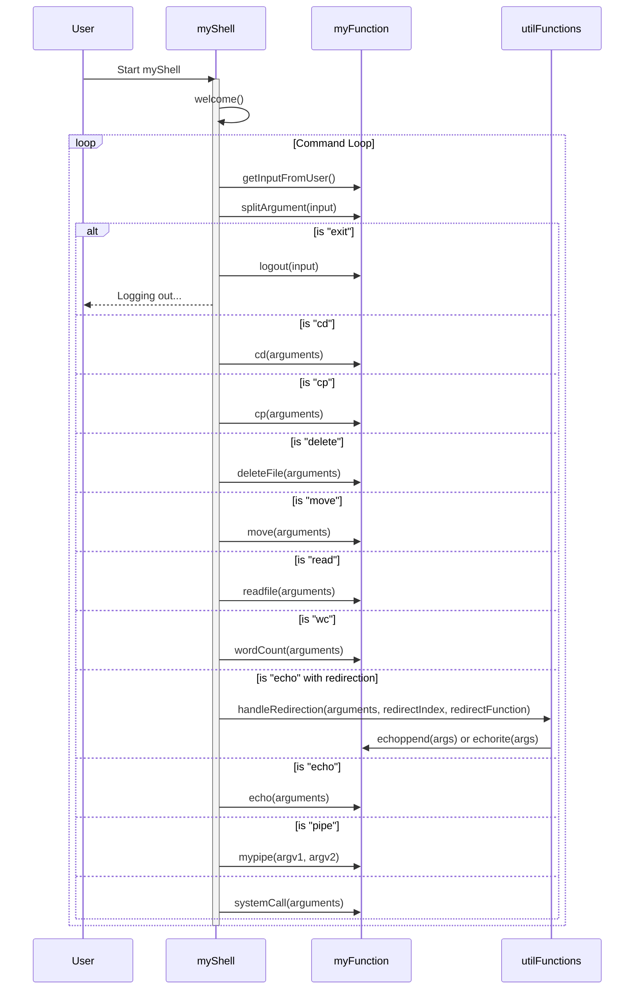

# myShell - A Custom Shell Implementation

## Overview
myShell is a custom shell implementation in C, designed to provide basic shell functionalities such as executing commands, handling file operations, and supporting redirection and piping. This document outlines the key features and usage of myShell.

## Sequence Diagram



## Features
- **Custom Welcome Message**: Displays a unique welcome message upon startup.
- **Built-in Commands**: Includes several built-in commands like cd, cp, delete, move, read, wc (word count), echo, and more.
- **File Redirection**: Supports file redirection using `>`, `>>` for commands like echo.
- **Piping**: Allows piping between commands with `|`.
- **Dynamic Input Handling**: Dynamically handles user input for command execution.
- **Memory Management**: Ensures proper allocation and deallocation of memory for dynamic data.

## Usage

### Compilation
To compile myShell, use the provided Makefile:
```makefile
make all
```
This compiles the shell and executes it. For memory leak checks, use:
```makefile
make leak
```

### Built-in Commands
- **cd**: Change the current directory.
    ```c
    cd <directory_path>
    ```
- **cp**: Copy a file.
    ```c
    cp <source_file> <destination_file>
    ```
- **delete**: Delete a file.
    ```c
    delete <file_path>
    ```
- **move**: Move a file (essentially `cp` followed by `delete`).
    ```c
    move <source_file> <destination_file>
    ```
- **read**: Read and display the content of a file.
    ```c
    read <file_path>
    ```
- **wc**: Count words or lines in a file.
    ```c
    wc -l|-w <file_path>
    ```
- **echo**: Print text to the console. Supports redirection.
    ```c
    echo <text> > <file_path>
    echo <text> >> <file_path>
    ```
- **exit**: Exit the shell.
    ```c
    exit
    ```

### Redirection and Piping
- **Redirection**: Use `>` to overwrite a file or `>>` to append to a file.
- **Piping**: Use `|` to pipe the output of one command as input to another.

### Custom Welcome Message
Upon starting, `myShell` displays a custom welcome message defined in `myShell.c`.

### Dynamic Input and Argument Splitting
`myShell` dynamically handles user input, allowing for variable-length commands. It also supports quoted arguments for paths containing spaces.

## Development Notes
- **Memory Management**: Ensure proper memory allocation and deallocation to avoid leaks.
- **Error Handling**: Robust error handling is implemented for file operations and command execution.
- **Extensibility**: New commands and features can be added by extending the `myFunction.c` and `utilFunctions.c` files.

## License
`myShell` is open-source software. Please check the repository for the specific license details.

## Acknowledgments
This project is inspired by the desire to understand how shell environments work and to provide a simple, extensible shell for educational purposes.
